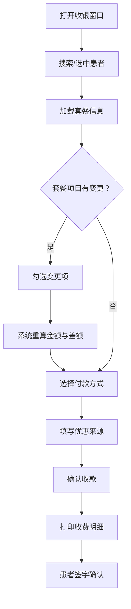

## 1. 产品概述

面向口腔诊所前台与收费员的桌面端套餐收银窗口，核心目标是帮助收费员在患者结账前快速核对"医生开单 → 套餐价格 → 实际应收"三者是否一致，减少漏收、错收、争议收的情况，同时留存完整的优惠与付款凭证，方便晚班交账复核。

- 目标用户：口腔诊所前台接待员、收费员
- 产品价值：将原本依赖纸质单据和口头确认的收费流程数字化，提升结账效率与透明度，降低差错率

## 2. 核心功能

### 2.1 用户角色

| 角色 | 使用场景 | 核心权限 |
|------|----------|----------|
| 前台接待员 | 接待患者、查询就诊信息、确认套餐 | 查看、搜索、确认套餐 |
| 收费员 | 核对费用、处理变更、收款、打印明细 | 前台全部权限 + 变更套餐项 + 收款 + 打印 |

### 2.2 功能模块

1. **收银主窗口**：今日就诊列表、套餐确认、收款备注三区布局
2. **打印预览**：收费明细打印页面，供患者签字确认

### 2.3 页面详情

| 页面名称 | 模块名称 | 功能描述 |
|----------|----------|----------|
| 收银主窗口 | 今日就诊列表 | 展示今日所有就诊患者，支持按手机号/病历号搜索，点击选中后加载套餐信息 |
| 收银主窗口 | 套餐确认 | 展示医生选定的诊疗套餐及包含项目，标注已完成/待复诊项目；支持临时增加拍片、麻药、升级材料等变更项，实时重算应收金额与差额 |
| 收银主窗口 | 收款备注 | 选择付款方式（现金/扫码/分期定金），填写优惠来源（会员价/院长特批/团购核销），备注信息，确认收款 |
| 打印预览 | 收费明细 | 生成简洁收费明细单，包含患者信息、套餐项目、变更项、金额明细、优惠信息、付款方式，支持打印 |

## 3. 核心流程

用户打开收银窗口 → 在今日就诊列表中搜索或选中患者 → 系统加载该患者的套餐信息 → 收费员核对套餐项目，如有变更则勾选变更项 → 系统重新计算应收金额并显示差额说明 → 收费员选择付款方式、填写优惠来源 → 确认收款 → 打印收费明细 → 患者签字确认

## 4. 用户界面设计

### 4.1 设计风格

- **调性**：极简、专业、高效——减少视觉干扰，突出信息层级与操作引导
- **主色**：深炭灰（#1C1C1E）为文字基调，翡翠绿（#0A8F6C）为强调/确认色，暖白（#FAFAF8）为底色
- **辅助色**：琥珀橙（#E8913A）用于警告/差额提示，浅灰（#F2F2F0）用于区块分隔
- **字体**：Noto Sans SC（界面主体）+ DM Mono（金额数字），层级清晰
- **按钮**：小圆角（4px），确认按钮实心翡翠绿，次要按钮描边式
- **布局**：桌面端三栏横向布局，左侧就诊列表、中间套餐确认、右侧收款备注
- **图标**：使用 Lucide 图标库，线条风格统一

### 4.2 页面设计概览

| 页面名称 | 模块名称 | UI 元素 |
|----------|----------|----------|
| 收银主窗口 | 今日就诊列表 | 搜索框 + 患者卡片列表，卡片显示姓名/手机尾号/就诊时间/医生，选中态翡翠绿左边框 |
| 收银主窗口 | 套餐确认 | 套餐名称标题 + 项目清单表格（项目名/单价/状态标签）+ 变更项勾选区 + 应收金额与差额醒目显示 |
| 收银主窗口 | 收款备注 | 付款方式单选按钮组 + 优惠来源下拉选择 + 优惠金额输入 + 备注文本框 + 确认收款按钮 |
| 打印预览 | 收费明细 | A5 纸张预览，顶部诊所信息，中部项目明细表，底部金额合计与签字栏 |

### 4.3 响应式策略

- 桌面优先设计，最小支持 1280px 宽度
- 三栏布局在 1280-1440px 下紧凑展示，1440px 以上舒适展示
- 不做移动端适配（桌面端专用工具）

### 4.4 3D 场景

不涉及
