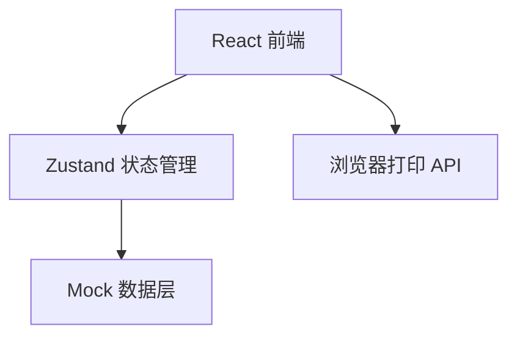
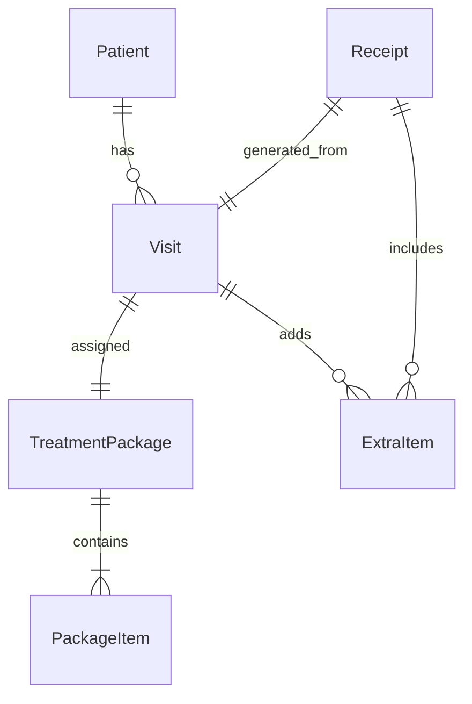

## 1. 架构设计



纯前端应用，使用 Mock 数据模拟后端接口，不涉及后端服务。打印功能通过浏览器 `window.print()` + CSS `@media print` 实现。

## 2. 技术说明

- 前端：React@18 + TypeScript + Tailwind CSS@3 + Vite
- 状态管理：Zustand
- 初始化工具：vite-init（react-ts 模板）
- 后端：无（Mock 数据）
- 图标：lucide-react

## 3. 路由定义

| 路由 | 用途 |
|------|------|
| / | 收银主窗口，包含今日就诊列表、套餐确认、收款备注三区 |

单页应用，仅一个主页面。打印预览通过浏览器打印对话框实现，不单独设置路由。

## 4. API 定义

无后端 API，使用 Mock 数据。定义以下数据结构：

```typescript
interface Patient {
  id: string
  name: string
  phone: string
  medicalRecordNo: string
  doctorName: string
  visitTime: string
}

interface PackageItem {
  id: string
  name: string
  unitPrice: number
  status: "completed" | "pending_followup"
}

interface TreatmentPackage {
  id: string
  name: string
  totalPrice: number
  items: PackageItem[]
}

interface ExtraItem {
  id: string
  name: string
  price: number
  category: "film" | "anesthesia" | "material_upgrade" | "other"
}

interface PaymentMethod {
  type: "cash" | "qr_code" | "installment_deposit"
  label: string
}

interface DiscountSource {
  type: "member_price" | "director_approval" | "group_purchase" | "none"
  label: string
}

interface InstallmentInfo {
  depositAmount: number
  remainingAmount: number
  nextVisitDate: string
}

interface CashierRecord {
  id: string
  patient: Patient
  package: TreatmentPackage
  extraItems: ExtraItem[]
  paymentMethod: string
  discountSource: string
  discountAmount: number
  totalAmount: number
  actualAmount: number
  installmentInfo?: InstallmentInfo
  remark: string
  paymentTime: string
  status: "paid"
}

interface ReceiptData {
  patient: Patient
  package: TreatmentPackage
  extraItems: ExtraItem[]
  paymentMethod: string
  discountSource: string
  discountAmount: number
  totalAmount: number
  actualAmount: number
  installmentInfo?: InstallmentInfo
  remark: string
  paymentTime?: string
  status: "pending" | "paid"
}
```

## 5. 服务端架构

不涉及

## 6. 数据模型

### 6.1 数据模型定义



### 6.2 数据定义

使用 TypeScript 类型定义 + 静态 Mock 数据，无需 DDL。
